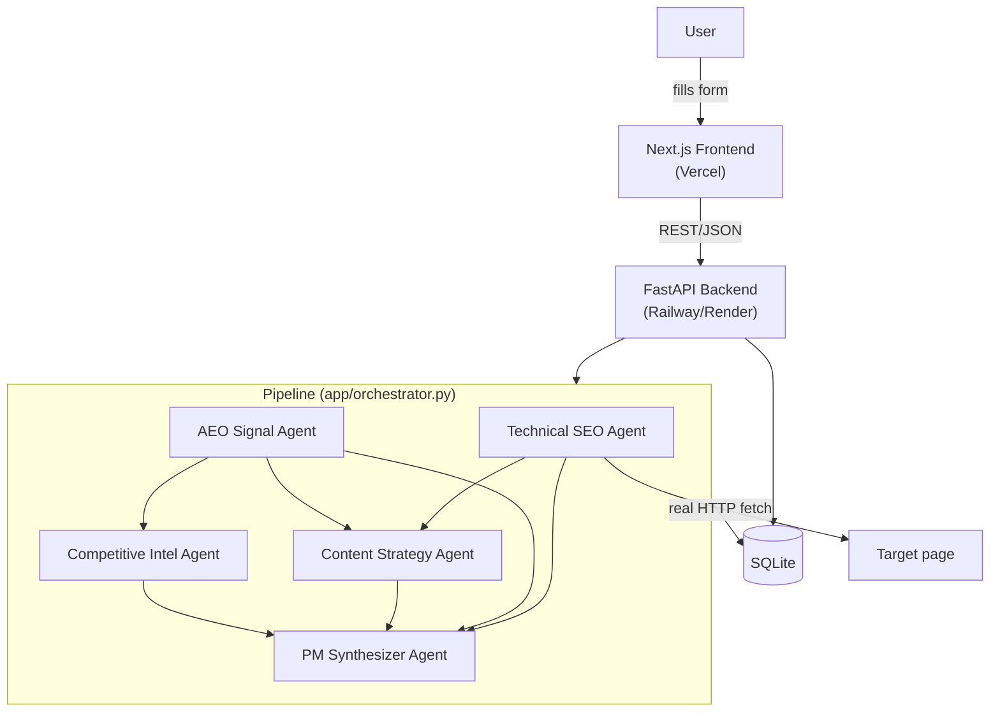

# AEO Product Ops System

A multi-agent system that audits, tests, and prioritizes what to fix for AI-answer-engine visibility — built to explore how product management works when "search" means being cited by ChatGPT/Perplexity/AI Overviews instead of ranking on a results page.

## The problem

A growing share of search queries now get answered directly by AI, with no click-through to a website. Companies have spent 20 years optimizing for traditional ranking factors, but there's no simple, repeatable way to measure whether a page is actually structured to be *cited* by an AI answer engine, or to turn that signal into a prioritized action plan the way SEO tools have long done for search ranking.

## What this does

Simulates a small cross-functional product team as five agents:

1. **Technical SEO Agent** — fetches the target page for real and checks schema markup (JSON-LD), title/meta tags, and heading structure
2. **AEO Signal Agent** — tests buyer queries to see if the target page gets cited by AI search, vs. up to 3 competitors
3. **Content Strategy Agent** — proposes specific content fixes grounded in the Technical SEO + AEO Signal findings
4. **Competitive Intel Agent** — synthesizes a citation-share benchmark against competitors from the AEO Signal data
5. **PM Synthesizer Agent** — turns all four agents' (often conflicting) findings into one RICE-scored, prioritized roadmap, a one-page PRD for the top item, and a stakeholder summary

The system closes the loop: re-run an audit against the same target/competitors/queries and it links the new run back to the original (`parent_run_id`), computes a citation-rate before/after comparison, and marks roadmap items as resolved once the underlying finding is fixed.

> **Current state:** the orchestration, database, and both the FastAPI backend and Next.js frontend are fully built and wired end-to-end. The five agents' "AI interpretation" step is currently mocked (clearly marked `# MOCKED` in each agent file) rather than calling the real Anthropic API, since that requires billing to be configured — swapping in the real call is a one-line change per agent once that's set up. The Technical SEO Agent's page fetch/parse *is* real (not mocked).

## Architecture



- **Frontend** (`/frontend`): Next.js 14 (App Router) + TypeScript + Tailwind. Home page (run an audit) · History (past runs, re-run for comparison) · Report (roadmap, PRD, stakeholder summary, before/after view).
- **Backend** (`/backend`): FastAPI, orchestrating the 5 agents in dependency order per run, persisting each agent's result and the resulting RICE roadmap to SQLite.
- **Database**: SQLite (`runs`, `agent_results`, `roadmap_items` — see `docs/project-docs.md` Doc 05 for the full schema).

## Local setup

**Backend:**
```bash
cd backend
python3 -m venv .venv && source .venv/bin/activate
pip install -r requirements.txt
cp ../.env.example ../.env   # fill in ANTHROPIC_API_KEY / PAGESPEED_API_KEY when ready — not required for the mocked agents to run
uvicorn app.main:app --reload --port 8000
```

**Frontend** (separate terminal):
```bash
cd frontend
npm install
cp .env.local.example .env.local
npm run dev
```

Then open `http://localhost:3000`.

## Deployment

- **Frontend → Vercel**: import the repo, set the project's root directory to `frontend`, and set `NEXT_PUBLIC_API_BASE_URL` to your deployed backend's URL.
- **Backend → Railway or Render**: root directory `backend`, build command `pip install -r requirements.txt`, start command `uvicorn app.main:app --host 0.0.0.0 --port $PORT` (a `Procfile` with this is already included). Set `FRONTEND_ORIGINS` to your deployed Vercel URL so CORS allows it.
- SQLite on most free-tier PaaS disks is **ephemeral** — data can be wiped on redeploy/restart. Fine for a portfolio demo; swap `DATABASE_URL` for a managed Postgres if you need real persistence.

## Before/After Result

<!-- TODO: fill in with a real before/after run — screenshot or describe the
     citation-rate change from an actual fix you shipped between two runs. -->

## Stack

Python (FastAPI) + Next.js, calling the Anthropic API directly — no agent framework dependency.
